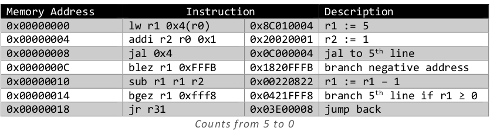

# A MIPS-like Single Cycle CPU

##  Implementations of Instructions

### nor

Implementation of nor instruction is straightforward. It is a basic Boolean operation and a R-type
instruction. Therefore, just like any other simple instructions (and, or, add, etc.) it is enough to send a
signal from the ALU control unit to the ALU.

### addi, andi, ori
These are I-type instructions. In control unit, whenever These instructions are detected, ALUSrc signal is
sent to read 16-bits immediate data and RegWrite signal is sent to write calculation to register. Also,
different ALUOp signals are sent to be redirected from ALU Control unit to ALU.

### bne, bgez, bgtz, blez, bltz
These are I-Type instructions and variation of branching. All of them triggers branch signal and zout if
comparison is success.

Detecting bne instruction is nothing but looking OPCODE. And its logic opposite of beq instruction.
Therefore, inverting zout signal is sufficient. To make this, a new signal zcond from control unit to ALU
is added.

The branch instructions other than bne have no second parameter to compared since first parameter is
compared with zero. Also, they are REGIMM instructions and their behavior depend on rt field. To detect
these instructions, rt field is passed to control unit. To compare parameter with zero, a new operation is
added to ALU. This operation depends on zcond signal to perform basic comparations (<, ≤, >, ≥).

### j, jal, jr
To implement jump instructions, a new signal jump is added. This signal is sent whenever j and jal
instructions are current one. Also, a new multiplexer (current address if signal is 0, otherwise new
address) and a shifter are added. The new address is calculated as following:

    jump_addr := concat(adder1_out[31:28], instruction[25:0] << 2)
    mux5 = jump ? jump_addr : mux4

In addition to jump signal, second signal jump_al is added for jal. This signal preserves next address in
31 st register.

    reg[31] := jump_al ? current_addr + 4 : reg[31]

For jr instruction, jump_reg signal and new multiplexer are added. The current address is resolved as
following:

    mux6 = jump_reg ? reg[rs] : mux5

Finally, program counter is updated as mux6.

## Design Details

cwz*:compare with zero

## Datapath

## Examples

Instructions are saved in `initIMx.dat` respectively. The default one is `initIM3.dat`.

